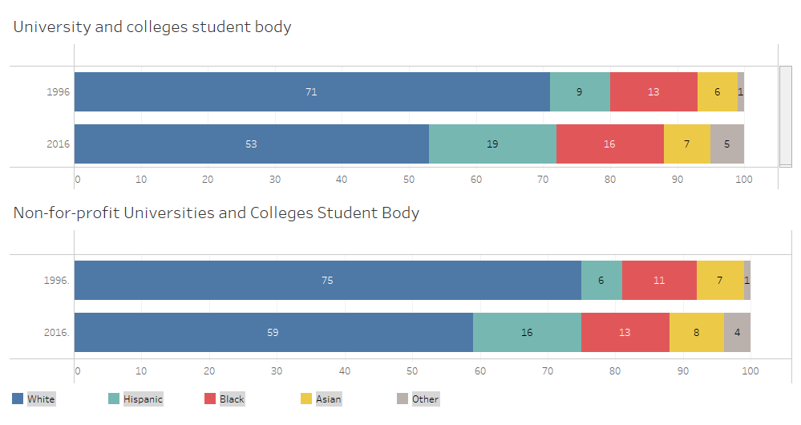

LOCKED DOORS 7

**Locked Doors: Racial Inequality in Education**

Tkachenko Nikita

University of San Francisco

December 3, 2020

**Locked Doors**

**Social lifts and their importance in the U.S.**

The United States of America was built on the values of equality and liberty for all. Do not confuse the American understanding of equality with the European notion of &quot;Everyone ending up equal,&quot; which implies an equal status, income, et cetera. In the U.S., people are given liberty to end up where ever their abilities, work ethics, and ambitions take them, meaning unequal. For that reason, NBA league players earn significantly more than doctors and software engineers. This idea is what makes the American dream possible — the self-made person who achieved wealth and high status through their hard work and dedication. Clearly, social mobility is essential for the U.S. to support its values. Nevertheless, does everyone have the same opportunity to use the gift of liberty?

_Figure 1 source: 43 GDIM. 2018._

First, let us examine the meaning of social mobility. Social mobility is a change in social status relative to one&#39;s current social location within a given society_._ In absolute terms, social mobility can be understood as an individual&#39;s movement in income and occupation. In relative, it is associated with opportunities for progression within the society. There are two approaches to understanding social mobility: a sociological one looks at society as at an occupational hierarchy, while the economic tradition focuses on income groups. For clarity, movement between income groups will be used as a measure of social mobility.

It has been getting progressively harder for people in the lower half of income distribution to make their way up the social ladder. Looking at figure 1, a person born in the 1980-s into the lower half of income has a 32% chance of breaking into the upper half. It would be a 50-50 split in a perfect world, but, in reality, being born into the lowest Quantiles is a significant disadvantage. The chances to transfer into the upper half have been steadily decreasing from 39% for those born in the 1940-s to 32% for those born in the 1980s. Another dawning observation is that the lower half is much likely to end up in Q4 than Q3, suggesting downward mobility for those born in the lower half - poor are getting poorer. However, who is affected the most by such a trend?

_Figure 2 source: https://opportunityinsights.org/data/_

Figure 2 shows the percentage difference from the fair 10% (if there was no inequality) of the number of children born in an income decile. For example, the last graph shows that a black kid has a 19% chance to be born into the lowest decile, which is 9% bigger than a fair 10%. In other words, bars above the zero before the half-line show disadvantage, and bars above the zero after the half-line show privilege. Figure 2 shows the unequal opportunities children are born into. Black and Hispanic are likely to be born into the lowest half, while a white kid has a high probability of being born into the highest deciles. For Asians, spikes on both ends are characterized by a massive inflow of educated professionals on the right end and American born Asians on the left end.

_Figure 3 source: 52_

The trend observation is further reinforced by income distribution by race (Figure 3), with blacks and Hispanics sitting at the lower end of income than the white population. Three observations combined tell a sad story of a pitfall for the black and Hispanic population. For them, it is almost impossible to achieve higher income as most of them are born poor.

However, what can be done to increase the mobility of the lower ends of the distribution, and what opportunities the less fortunate ones can use to achieve upward mobility?

One of the best social lifts is higher education. Students that attended the same college have similar earning in adulthood regardless of their background. Statistically, children from lower-income brackets are significantly less likely to leave their income bracket and to reach the top Quintiles of the income distribution than their wealthier counterparts. But when comparing students at the same university, inequality almost disappears, especially at highly selective colleges. This fact implies that poor students are not inferior at these elite institutions and that an increasing number of low-income students attending them would help even the income gap for minorities. _(17)_

_Figure 4 source: 52_
Figure 4 shows the share of different races attending colleges. The progress from 1996 to 2016 is very notable as the percentage of minority students has dramatically increased. However, this is only a small part of the picture. the completion rate for black people is significantly lower at the 40% mark than for white or Hispanic, 62%, and 52%, respectively. (15) This fact mitigates the increased enrollment rate and brings a new problem: after we get more black people to attend college, how do we make them stay?

_Figure 5 source: 22 https://nscresearchcenter.org/hsbenchmarks2016/_

Astudy &quot;High school Benchmarks – 2016&quot; found that despite the growing accessibility of education, the completion rate is devastating for graduates of high-minority, where at least 40% of students are black or Hispanic, and high-poverty schools, where at least 75% of the student population are eligible for free or reduced lunch. (figure 5) (22) In addition, bachelor degree completion is 41% for black, 54% for Hispanic, and 63% and 71% for white and Asian. (2)

As the largest part of black and Hispanic individuals is in high- poverty and minority schools, it becomes evident that the minority students have a far less chance of completing their degrees. Hence, the progress in college admission is mitigated by the low completion rate. It appears that we should look at the environment preceding the enrollment to find the reason for the high dropout rate.

While it appears that minority composition in colleges is representative, if we look closely, some universities are not doing as great. The number of Hispanic and black students in the U.C. system has declined after the ban on affirmative action in 1996; consequently, the number of Asian students has skyrocketed because Asians statistically have the best academic scores. (6)

Similarly, Ivy league schools have not achieved equal representation of all applicants. It is no secret that these schools require the highest academic excellence, which is hard to achieve for black and Hispanic scholars as they have fewer resources during their school years. (6)

To sum up, there is no stark underrepresentation of minorities in the education system in general. However, minorities have less access to the top tier opportunities, which provide the best mobility. To create a fairer environment, policymakers should be looking at situations in specific universities and support future applicants prior to admission.

**Poor Environment**

The environment plays a defining role in a person&#39;s development, but it might be even more critical than previously thought. The experience as early as kindergarten can have a lasting impact on one&#39;s earnings, degree attainment, and financial stability. The study by opportunity insights has found that the quality of kindergarten experience improves a person&#39;s income by 3.5% in the future, correlates to degree attainment, and whether one has a house and retirement savings. The mechanics of this are not straightforward, as test results fade away in few years; however, the researchers concluded that preschool experience forms the critical cognitive skill set, which includes concentration, effort, initiative, and confidence that persists throughout the school years and later in life. Undeniably, having a professional kindergarten teacher and a thriving environment translates to future success in life. (33) Unfortunately, good kindergarten is expensive, and minorities cannot afford it. The disadvantage is especially pronounced for Hispanic children, with only 55% of children going to a kindergarten. (16)

Moreover, the disadvantage begins even earlier. A study by Fryer and Levitt 2004 found that all children are born with equal abilities but rapidly diverge. To measure I.Q. of infants, researchers used the Early Childhood Longitudinal Survey, which was proven to modestly predict I.Q. at the age of 5. They found that the effects of socioeconomic factors, environment, number of siblings, race are statistically insignificant, and income predicts less than 0.2% of the variance. Despite the equal start, by the age of four, children in the lowest quintile score in the 34th on literacy and mathematics tests, while kids in the highest quintile land, on average, in the 69th. These differences are mainly a consequence of the home environment and family&#39;s spending ability. (45) (2)

The income level plays a crucial role when it comes to investing in one&#39;s kid. The richer one is, the more they can afford to spend on their children, and the number of investments has been multiplying over the past years. Music lessons, Sports, private tutors, SAT classes – are very expensive. And with affluent families spending seven times more than the poor, the difference becomes substantial. High-income allows spending not only more money but also more time. Mothers with a college degree spend, on average, four and a half hours more a week with their children than mothers with K-12 or less education. (47) By the age of three, professionals&#39; children have a 50% larger vocabulary than working-class children. Such a difference is attributed to the time parents spend with their kids.(2)

The period before university – primary and secondary school is no less significant. It is school that prepares children for the application. So, it is no surprise that the quality of school education correlates to pupils&#39; future achievements. The study by Raj Chetty used a &quot;value-added&quot; approach, which examines test scores to evaluate the impact of a teacher on the students&#39; future lives. Students assigned to a high V.A. teacher have better scores and excel in a variety of dimensions: they are more likely to attend college, earn higher salaries, and are less likely to have kids as teenagers. (35) Teacher&#39;s impact on earning is similar across all income levels, and having passionate professional teachers in school will have a lasting positive impact. However, high-minority, high-poverty schools can have budgets three times smaller than that of a high-income school within the same state. (14) The budget limitation hinders students&#39; opportunity for quality learning, limiting access to qualified teachers, challenging curriculum, and moderately sized classes – all that has been proven to have a significant influence on student&#39;s performance, accounting for over 50% of his/her test scores. For instance, according to the 2013–14 Civil Rights Data Collection, calculus, physics, and chemistry are offered only in 33%, 48%, and 65% of high-minority black and Hispanic schools when the same subjects in low-minority schools are offered in 56%, 67% and 78%, respectively.(2)With a shortage of teachers and a high turnover ratio in high-poverty schools, quality staffing is borderline impossible without government intervention. (26)

When a student of color manages to achieve high academic excellence, he does not know the benefits of applying to college or is afraid to apply to selective institutions. School counselors help students decide to enroll in college. Most high schools have at least one school counselor, but close to 1.6 million high school students got to schools with law enforcement officers but no college guidance. (48)

Research by Bryan J. in 2010 suggests that access to high school counseling is directly related to postsecondary results such as applying to college and matriculation. However, students of color often do not have access to counselors whose main job is to help students enroll in college. (10)

As previously shown, non-Asian minorities struggle to complete their higher education. The reasons for that often involve unfamiliarity with course work and resources available, lack of funding, and understanding of the benefits of persisting through college. All of these issues can be addressed to improve the graduation rate for students of color as net benefit from them far exceeds costs.

Another contributing factor to minority children&#39;s disadvantage is that pre-teen pregnancy is much common in non-Asian minorities or before parents have gained substantial financial ground to provide opportunities to their children. Combined with figure 2, this fact explains the spike of birth of children in the lower-income deciles. Many of the parents (Figure 8) are neither mature nor experienced enough to be able to provide for their kids. (12)

_Figure 6 source: 25_

Another study examined the connection of mother&#39;s first birth age to kid&#39;s success in achieving a high school diploma, financial independence of public support, and delay in having a child until age 20 or older. After controlling for race and gender of the child, poverty, education, and marital status of the mothers, researchers found that children of the teenage mom were less likely to achieve success in these areas than those born by moms in the early &#39;20s. In turn, children born to mothers 25 and older were more likely to succeed than those born to mothers in their 20s. (41)

In combination with the figure 8 and figure 2, it becomes evident that many children of black and Hispanic origin are born by mothers before 25 years old while the white and Asian population is skewed towards the older ages, which provides the advantage to their children. Additionally, black (65%) and Hispanic (40%) children are twice as likely to live in a single-parent family as white (21%). Because black and Hispanic children are born in low-income brackets by young and very often single mothers, they have fewer resources to succeed. (28)

**SAT**

Standardized tests are used all across the world to make admission to distant universities accessible to everyone. In Russia, the Unified State Exam (USE) was created to give every bright kid from a village, remote city equal opportunity to receive the best education. USE became an escape hatch for everyone who could show academic proficiency. Unfortunately, such wonder is impossible in the U.S. because of the extensive history of racism. Today, the SAT is best suited for predicting one&#39;s race rather than academic proficiency.

Based on the official College Board information, in admission process schools look at courses taken, grades received, class rank, standardized test scores, personal statements and essays, recommendations, extracurricular activities, and Interviews. The most important on the list are GPA and SAT scores.

With colleges receiving as many as 70,000 admissions each season, SAT score became a crucial means in separating prospective students. It is no secret that more competitive and prestigious schools have a high SAT threshold. Moreover, many merit-based programs will require a high SAT score to calculate the grant. For example, the University of San Francisco awards merit scholarships based on SAT and high school GPA. Such a program might appear fair, but it creates fewer opportunities for minorities to get into a college and receive scholarships. (54)

_Figure 7 source: SAT Annual Report by College Board (2007 – 2020)_

Based on almost 100 years of SAT statistics, the test has a distinct correlation between SAT score and race (Figure 7). The white/black score gap has stayed on the level at around 210 points since 1998, based on official college board reports. (53) An analysis of over a million University of California admitters from 1994 through 2011 examined the impact of race and other socioeconomic factors on SAT scores and college success. The report showcased that family income, parents&#39; education, and minority status explained 35% of SAT variance in 2011. From these three regression coefficients, the most impactful was the minority status at 0.29, followed by Parents&#39; education at 0.27 and Family income at 0.18, making race the single strongest predictor of the test&#39;s success. The finding shows that race factor is not reducible to income level and parent&#39;s education, but contains other more pronounced for the students of color factors. One possible explanation could be the home environment, quality of school education, and poor healthcare – factors that disproportionally affect black students. (19)

Not only is the SAT highly correlated with race, but also the test itself is not a reliable predictor of the very thing it was created to explain – college success. Using a massive sample of entering first-year students at 21 state flagship universities and four state higher education systems, Bowen and his colleagues in 2009 found that SAT/ACT scores are not a reliable predictor of graduation and would often fail significance tests depending on the institution. On the other hand, GPA is the single best predictor of four- and six-year graduation rates after accounting for a test score. (44)

To illustrate how overly important the SAT is, consider the example: two students are identical in every aspect, but the SAT will be judged based on their test scores. If one has a 1200 SAT score, they are predicted to earn a 3.0 GPA in college while the other with 1300 is expected to earn 3.13. The error band for 1.1 million U.C. students&#39; sample was 0.82 at the 95% confidence level. In other words, performance for both students is likely to be somewhere between A- and C+.

_Figure 8 source: 19 https://escholarship.org/uc/item/9gs5v3pv#main_

SAT-based admission intensifies racial stratification in admission. 1.1 million U.C. applicants were divided into deciles based on their test scores (figure 7). At the bottom of the applicant pool, Latino and black applicants comprise 60 percent of the lowest SAT decile but only 39 percent of the lowest High School GPA decile. Conversely, within the top decile – those likely to be admitted – Latinos and blacks comprise 12 percent of applicants when ranked by high school grades but just 5 percent when ranked by SAT scores. Using SAT scores to rank applicants produced more severe racial/ethnic stratification than if high school GPA was used.

Another way to grade a student is to look at &quot;Strength of curriculum,&quot; which is most often measured by the number of A.P. classes. The problem with A.P. classes that they are not available to everyone. Additionally, many minorities either cannot attend classes or get tracked out of them. Furthermore, A.P.s did not impact how a student performed at U.C. For these reasons, the number of A.P. classes is not justified to be used in admission. The same issue affects the approach with GPA. National Association for College Admission Counseling found that about 70 percent of all U.S. high schools award &quot;bonus points&quot; for A.P. classes in calculating students&#39; GPAs. For instance, a grade &quot;B&quot; in A.P. will be counted as 4 points instead of 3. Such practice creates inflation of GPA as average applicants to UC Berkley have a 4.2 GPA.

A high school GPA is a valid admissions criterion as it remains the strongest predictor of a student&#39;s college performance. Usage of &quot;weighted&quot; GPA with additional points from A.P. classes is unnecessary as it provides _so_ little while creating a disadvantage for students of color.

**Solutions**

The situation with education inequality cannot be solved naturally as it perpetuates itself: minorities were pushed into the lower class through years of segregation and racism. They cannot receive an education because they cannot pay for it, and they cannot afford it because they are in the lower class because they cannot afford education. Without outside intervention, it would take many generations to erase such a pattern. There is a number of solutions that can be implemented today.

First, the SAT and similar tests play a disproportionally important role in college admission. Their ineffectiveness at predicting future performance at a university must be accounted for during the decision-making process. On the other hand, an unweighted GPA is a good predictor of a student&#39;s success. Using it instead of the test results and weighted GPA would help promote a diverse studying environment. Opting for an individualized review will allow the admission officer to see the actual person behind the numbers and make a fair decision based on personality and not test-taking skills. Taking an extra step to interview applicants would improve the situation.

Second, making kindergarten more available to low-income citizens, financing under-funded kindergartens, and encouraging professional teachers to work at high-minority institutions would provide early development that working parents cannot provide to their children.

Third, most minority children study at underfunded schools where the quality of education is below the required for a prosperous future. Hence, further improvement of the school system is needed, such as additional funding from state and federal government, encouraging more people to enter teaching professions and professionals to work at minority schools, expanding the range of classes, and creating challenging opportunities.

Finally, low-cost interventions have been proven to be effective. Figure 9 shows what low-cost intervention to current federal and state programs can help send more people to college and help them persist. One study found that helping low-income students to apply for financial aid increases enrollment by eight percentage points, with a cost of less than $100 per student. Moreover, employing advisors to individually coach students on the value of persisting through college beyond freshman year is $10,000 less expensive than providing scholarships. (51)

One study finds that sending high-achieving, low-income students mail with information on their college options pushed them to apply to better schools. It would cost only $6 per student to increase low-income students&#39; applications to selective school by more than 30% percentage points. (50)

_Figure 9 source: 20_

Money was always a problem for those looking to pursue a college degree(43), so to enhance social mobility, federal grants are essential to enable low- and middle- income students to pay for tuition. One research estimated that an increase of $1000 in college aid increases college enrollment by 3 to 6 percentage points depending on a program. Sending one student through these aid programs costs between $20000 and $30000. Compared to an increase in earning for college graduates of $30000 per year, the programs provide a net benefit for the economy. (49)

Lastly, preventing early pregnancy and providing child support is a necessary means. With a majority of Hispanic and Black people being born in the lowest 30% of the income, it is vital to increase the average birth age for these minorities as young single mothers often do not have adequate resources to ensure the child&#39;s future success.

In conclusion, racial inequality in education is not an isolated problem. Like many other struggles, it comes from years of oppression and systematic racism, pushing the minorities into the lowest income brackets. Lack of education and financial resources predict the future of children born to minorities. The problem will not solve itself with time without outside intervention. It is our duty as a society to create equal opportunities for those that are at a disadvantage.

# Bibliography

1. -. (n.d.). _Americans Instrumental in Establishing Standardized Tests._ Retrieved from PBS: https://www.pbs.org/wgbh/pages/frontline/shows/sats/where/three.html
2. (2016). _Advancing Diversity and Inclusion in Higher Education._ Office of Planning, Evaluation and Policy Development Office of the Under Secretary U.S. Department of Education. https://www2.ed.gov/rschstat/research/pubs/advancing-diversity-inclusion.pdf
3. Aldric, A. (2020, October 1). _Average SAT Scores Over Time: 1972 - 2020._ Retrieved from blog.prepscholar.com: https://blog.prepscholar.com/average-sat-scores-over-time
4. Allensworth, E. M., &amp; Clark, K. (2020, January 27). _High School GPAs and ACT Scores as Predictors of College Completion: Examining Assumptions About Consistency Across High Schools._ Retrieved from Sage Journals: https://journals.sagepub.com/doi/full/10.3102/0013189X20902110
5. American Association of School Administrators. (n.d.). School Budgets 101. Retrieved from https://www.aasa.org/uploadedfiles/policy\_and\_advocacy/files/schoolbudgetbrieffinal.pdf
6. ASHKENA, J., PARK, H., &amp; PEARCE, A. (2017, August 24). _Even With Affirmative Action, Blacks and Hispanics Are More Underrepresented at Top Colleges Than 35 Years Ago._ Retrieved from The New York Times: https://www.nytimes.com/interactive/2017/08/24/us/affirmative-action.html
7. Beale, A. V. (1970, November). The Evolution of College Admission Requirements. _The National ACAC Journal, 15_(3). Retrieved from https://files.eric.ed.gov/fulltext/EJ992666.pdf
8. Bleemer, Z. (n.d.). _The impact of Proposition 209 and access-oriented U.C. admissions policies on underrepresented U.C. applications, enrollment, and long-run student outcomes._ Institutional Research and Academic Planning, U.C. Office of the President.
9. Brigham, C. C. (1923). _A Study of American Intelligence._ Princeton: Princeton University Press.
10. Bryan, J., Moore-Thomas, C., Day-Vines, N. L., &amp; Holcomb-McCoy, C. (2010). _School Counselors as Social Capital:The Effects of High School CollegeCounseling on College Application Rates._ Retrieved from https://www.researchgate.net/publication/263616900\_School\_Counselors\_as\_Social\_Capital\_The\_Effects\_of\_High\_School\_College\_Counseling\_on\_College\_Application\_Rates
11. Bureau, P. R. (2017). _analysis of data from the U.S. Census Bureau&#39;s American Community Survey microdata files._
12. Centers for Disease Control And Prevention. (2019, March 1). _Reproductive Health: Teen Pregnancy._ Retrieved from Centers for Disease Control And Prevention: https://www.cdc.gov/teenpregnancy/about/index.htm
13. College Board. (n.d.). _Help your students understand what really matters to colleges._ Retrieved from College Board: https://professionals.collegeboard.org/guidance/applications/decisions
14. Darling-Hammond, L. (1998, March 1). _Unequal Opportunity: Race and Education._ Retrieved from Brookings: https://www.brookings.edu/articles/unequal- -race-and-education/
15. de Brey, C., Musu, L., McFarland, J., Wilkinson-Flicker, S., Diliberti, M., &amp; Zhang Anlan. (2019, February). _Status and Trends in the Education_
16. _._ Retrieved from nces.ed.gov.
17. org. (2020, 1 15). _Neighborhood preschool enrollment patterns by race/ethnicity._ Retrieved from Diversitydatakids.org: http://www.diversitydatakids.org/research-library/data-visualization/neighborhood-preschool-enrollment-patterns-raceethnicity
18. _Education_. (n.d.). Retrieved from Opportunity Insights: https://opportunityinsights.org/education/
19. García, E., &amp; Weiss, E. (2015, June 17). _Early Education Gaps by Social Class and Race Start U.S. Children Out on Unequal Footing._ Retrieved from Economic Policy Institute: https://www.epi.org/publication/early-education-gaps-by-social-class-and-race-start-u-s-children-out-on-unequal-footing-a-summary-of-the-major-findings-in-inequalities-at-the-starting-gate/
20. Geiser, S. (2015, October). THE GROWING CORRELATION BETWEEN RACE AND SAT SCORES: New Findings from California. _CSHE_. https://escholarship.org/uc/item/9gs5v3pv#main
21. Greenstone, M., Adam Looney, Patashnik, J., &amp; Yu, M. (2013, June 26). _Thirteen Economic Facts About Social Mobility and the Role of Education - Full Policy Memo._ Retrieved from brookings.edu: https://www.brookings.edu/research/thirteen-economic-facts-about-social-mobility-and-the-role-of-education/
22. Hammond, B. G. (2020, August 17). _The Sat and Systemic Racism._ Retrieved from Inside Higher E.D.: https://www.insidehighered.com/admissions/views/2020/08/17/history-sat-reflects-systemic-racism-opinion
23. _High School Benchmarks - 2016._ (2016, October 27). Retrieved from National Student ClearingHouse: https://nscresearchcenter.org/hsbenchmarks2016/
24. _Historical Income Tables: Households_. (n.d.). Retrieved from United States Census Bureau: https://www.census.gov/data/tables/time-series/demo/income-poverty/historical-income-households.html
25. Info Please. (n.d.). _Births by Age and Race of Mother._ Retrieved from Info Please: https://www.infoplease.com/us/population/births-age-and-race-mother
26. Ingersoll, R. M. (2004). _Why Do High-Poverty Schools Have Difficulty Staffing Their Classrooms with Qualified Teachers?_ Center for American Progress. Retrieved from https://www.americanprogress.org/wp-content/uploads/kf/ingersoll-final.pdf
27. Jaschik, S. (2020, April 13). _Losing Minority Students._ Retrieved from Inside Higher E.D.: Losing Minority Students
28. Kids Count Data Center. (2020, January). _Children in Single-Parent families by race in the United States._ Retrieved from Kids Count Data Center: https://datacenter.kidscount.org/data/tables/107-children-in-single-parent-families-by-race#detailed/1/any/false/37,871,870,573,869,36,868,867,133,38/10,11,9,12,1,185,13/432,431
29. Luo, T., &amp; Holden, R. J. (2014). _Investment in higher education by race and ethnicity._ U.S. Bureau of Labor Statistics. Monthly Labor Review. Retrieved from https://doi.org/10.21916/mlr.2014.9
30. Mitnik, P. A., &amp; Grusky, D. B. (2015). _Economic Mobility in the United States._ The Pew Charitable Trusts and the Russell Sage Foundation.
31. National Center for Education Statistics. (2020). _The Condition of Education._ National Center for Education Statistics. Retrieved from https://nces.ed.gov/programs/coe/pdf/coe\_cpb.pdf
32. Nunn, A., Johnson, S., Monro, S., Bickerstaffe , T., &amp; Kelsey, S. (2017). _Factors influencing social mobility._ Department for Work and Pensions.
33. Opportunity Insights. (n.d.). _Data_. Retrieved from Opportunity Insights: https://opportunityinsights.org/data/
34. Raj, C. (2010). $320,000 Kindergarten Teachers. _Kappan, 92_(3), 22-25. Retrieved from https://opportunityinsights.org/wp-content/uploads/2018/03/star\_summary.pdf
35. Raj, C. (n.d.). _THE LONG-TERM IMPACTS OF TEACHERS: TEACHER VALUE-ADDED AND STUDENT OUTCOMES IN ADULTHOOD._ Retrieved from https://opportunityinsights.org/wp-content/uploads/2018/03/teachers\_summary.pdf
36. Rakesh, K., &amp; Anthony, C. (n.d.). _Income Inequality in the U.S. is Rising Most Rapidly Among Asians._ Retrieved from Pew Research Center: https://www.pewsocialtrends.org/2018/07/12/appendix-a-income-distributions-of-whites-blacks-hispanics-and-asians-in-the-u-s-1970-and-2016/
37. (2008). _Report of the Commission on the Use of Stardized Tests in Udergraduate Admission._ Counseling, National Association for College Admission.
38. Richard, F., &amp; Anthony, C. (2019). _A Rising Share of Undergraduates Are From Poor Families, Especially at Less Selective Colleges._ Pew Research Center.
39. Rushton, P. J., &amp; Jensen, A. R. (2005). THIRTY YEARS OF RESEARCH ON RACE. _Psychology, Public Policy, and Law, 11_, 235–294.
40. Sawhill, I. V. (2013). _Higher Education and the Opportunity Gap._ Brookings. Retrieved from https://www.brookings.edu/research/higher-education-and-the-opportunity-gap/
41. Smart, M. (n.d.). _Mother&#39;s Age Contributing to Child&#39;s Success._ Retrieved from BYU | Magazine: https://magazine.byu.edu/article/mothers-age-contributes-to-childs-success/
42. Snyder, T. D. (Ed.). (1993, January). _120 Years of American Education: A Statistical Portrait._ Retrieved from nces.ed.gov: https://nces.ed.gov/pubs93/93442.pdf
43. staff, C. (2017, June 7). _Addressing the College Completion Gap Among Low-Income Students._ Retrieved from College of America: https://collegeforamerica.org/college-completion-low-income-students/

1. &quot;GDIM. 2018. Global Database on Intergenerational Mobility. Development Research Group, World Bank. Washington, D.C.: World Bank Group.&quot;
  1. &quot;Narayan, Ambar; Van der Weide, Roy; Cojocaru, Alexandru; Lakner, Christoph; Redaelli, Silvia; Mahler, Daniel Gerszon; Ramasubbaiah, Rakesh Gupta N.; Thewissen, Stefan. 2018. Fair Progress? : Economic Mobility Across Generations Around the World. Equity and Development. Washington, DC: World Bank. https://openknowledge.worldbank.org/handle/10986/28428 License: CC BY 3.0 IGO.
2. Vars, F. E., &amp; Bowen, W. G. (1998). _Scholastic Aptitude Test scores, race, and academic performance in selective colleges and universities._ In C. Jencks &amp; M. Phillips (Eds.), _The Black–White test score gap_ (p. 457–479). Brookings Institution Press.
3. Fryer R, Levitt S. [Understanding The Black-White Test Score Gap in the First Two Years of School](https://scholar.harvard.edu/fryer/publications/understanding-black-white-test-score-gap-first-two-years-school). The Review of Economics and Statistics. 2004.
4. Guryan, Jonathan, Erik Hurst, and Melissa Kearney. 2008. &quot;Parental Education and Parental Time with Children.&quot; _Journal of Economic Perspectives_, 22 (3): 23-46.
5. High School Longitudinal Study of 2009 [Internet]. National Center for Education Statistics 2009. 2011. Available from: https://nces.ed.gov/pubs2011/2011355.pdf
6. Deming, David &amp; Dynarski, Susan. (2009). Into College, Out of Poverty? Policies to Increase the Postsecondary Attainment of the Poor. 10.3386/w15387.
7. Caroline Hoxby &amp; Sarah Turner, 2015. &quot;[**What High-Achieving Low-Income Students Know About College**](https://ideas.repec.org/p/nbr/nberwo/20861.html),&quot; [NBER Working Papers](https://ideas.repec.org/s/nbr/nberwo.html) 20861, National Bureau of Economic Research, Inc.
8. Bettinger, Eric &amp; Baker, Rachel. (2011). The Effects of Student Coaching in College: An Evaluation of a Randomized Experiment in Student Mentoring.
9. Steven Ruggles, Sarah Flood, Ronald Goeken, Josiah Grover, Erin Meyer, Jose Pacas and Matthew Sobek. IPUMS USA: Version 10.0 [dataset]. Minneapolis, MN: IPUMS, 2020. [https://doi.org/10.18128/D010.V10.0](https://doi.org/10.18128/D010.V10.0)
10. SAT Annual Report by College Board (2007 – 2020)
11. Kantrowitz, M. (2011, September 2). _Student Aid Policy Analysis; The Distribution of Grants and Scholarships by Race_ (Rep.). Retrieved from https://www.racialequitytools.org/resourcefiles/Distributionracescholarships.pdf
